# Bookit
A website for booking the use of and making postings for sports facilities in the UK. 
See [here](https://bookit-5p.herokuapp.com/) for the deployed site.

### Note:
See [Features](#features-left-to-implent) about current limitations


## User Stories
- As a user I want to be able to create an account
- As a user I want to be able to search for a facility by tag, location and radius
- As a user I want to make a booking at a facility of my chouce
- As a user I want to be able to see all of my bookings
- As a facility owner I want to be able to make multiple new facilities
- As a facility owner I want to edit my pre-existing facilities
- As a facility owner I want to be able edit my facilities
- As a facility owner I want to be able to add new timeslots to my facilities
- As a facility owner I want to be able to modify my existing facilities timeslots
- As a facility owner I want to be able to delete existing timeslots
- As a facility owner I want to add new tags to my facilities
- As a facility owner I want to remove tags from my facilities
- As a admin I want to be able to create new tags
- As a admin I want to be able to modify existing tags
- As a admin I want to be able to be able to delete existing tags
- As a admin I want to be able to make changes to any facility

## UX
As the site revolves around a single purpose I chose to keep the UX simple and have multiple ways to this main purpose,(which is booking a sports facility) at a time, so that the user is always able to get to the search page.

For the actual booking page, I will be using a calendar and a table, from which the user will select a date from the calendar and the table will be updated to display a list times. This will be an easy to understand and use system, while also being easy to display on both mobile and desktop devices.

All admin/owner pages will be table layouts as they will be mainly just displaying data and this will be the easiest and most concise way to display such data.

### Wireframes
Register

Login

Search
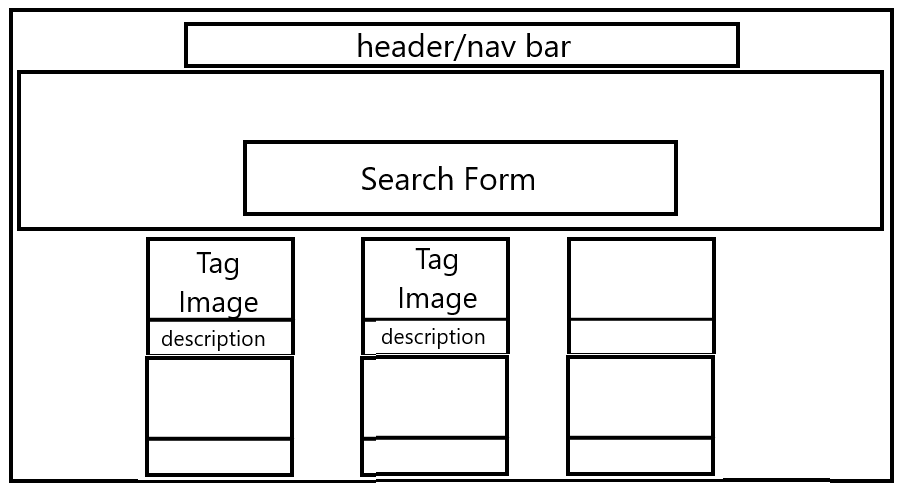

Results
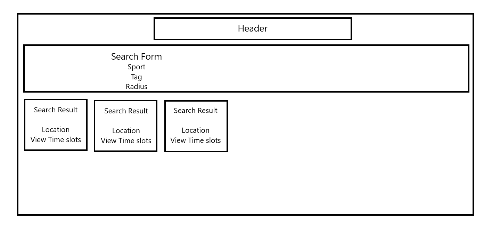

Book
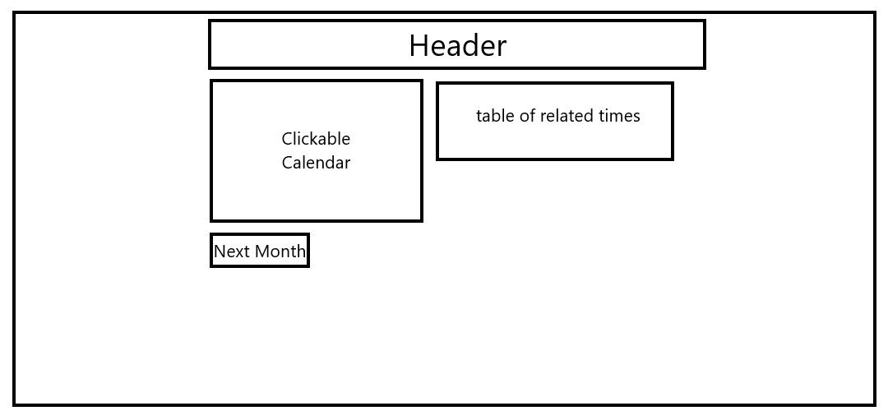

View Bookings
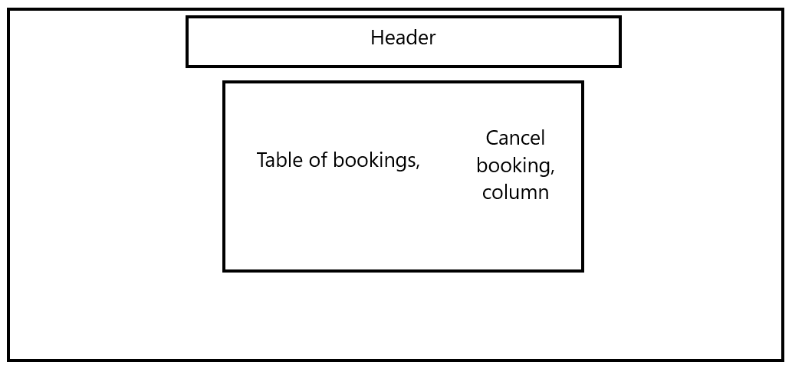

View Facilities

Modify Timeslots
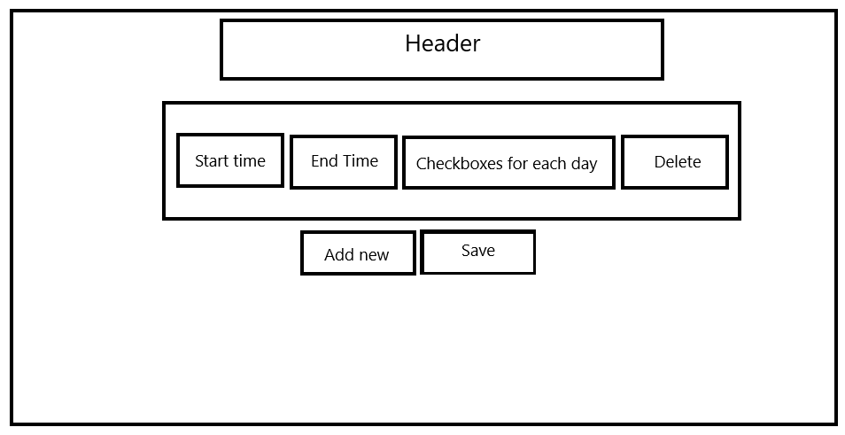

Modify Facility Tags
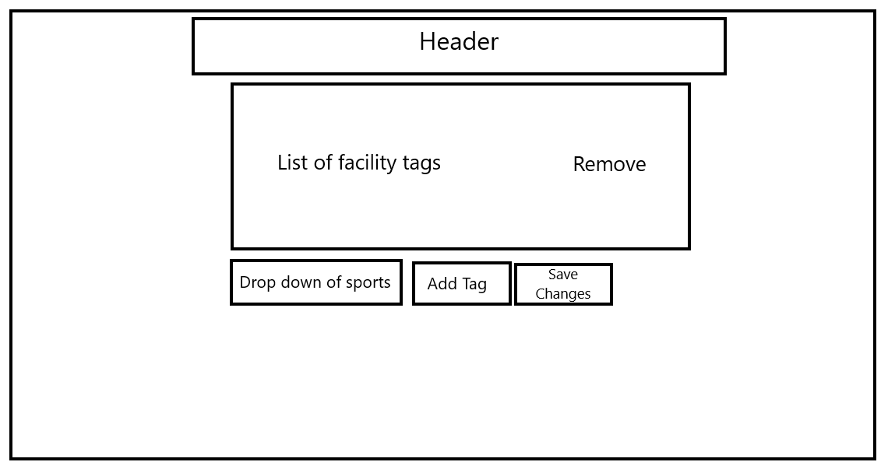

### ERD
Entity Relationship Diagram that I used to create 
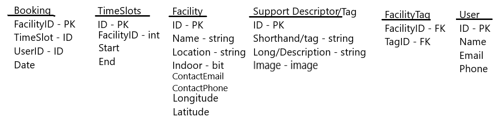
## Features
### Existing Features
- Nav bar leading to differnt pages


- Form to search for facilities on index
    - Takes a tag via drop down
    - A location (preferably a town/city in the GB)
    - A distance in miles
    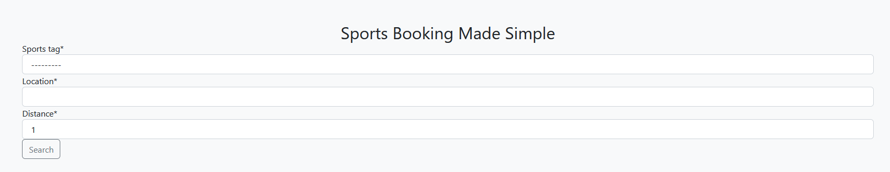

- A list of sports offered
    - Taken from the "Tag" table and updates live to reflect the table
    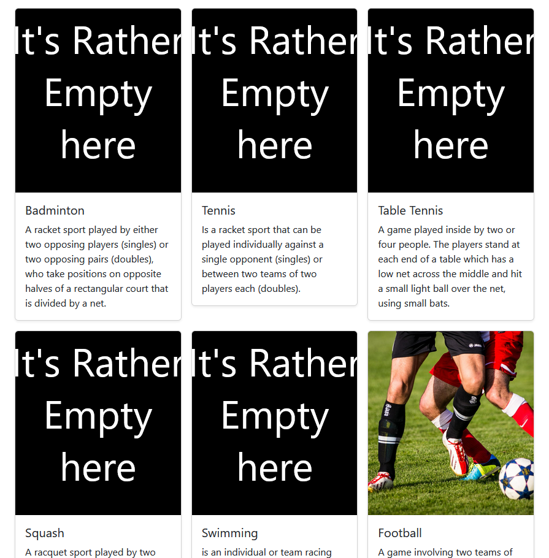

- Clickable calendar to visually choose what date you want
    - Reveals a table of times available on that date
    - Booked times will still be shown by greyed out
    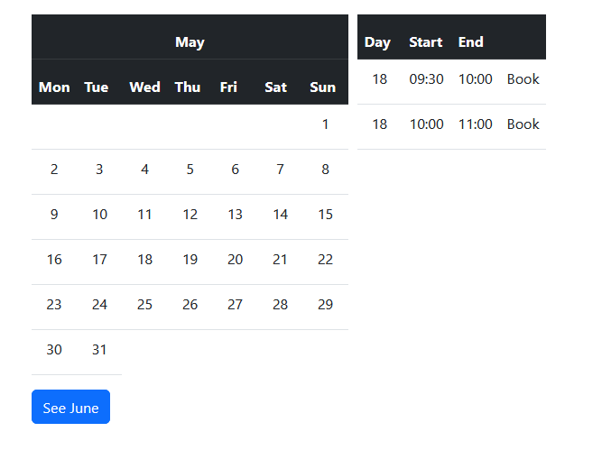

- Page to see all of your bookings
    - With the functionality to cancel it
    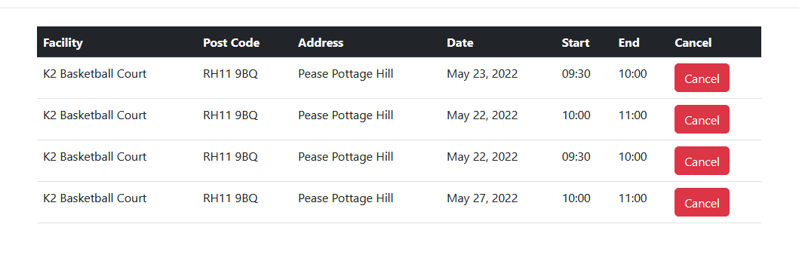

- A Search results page that lists relevant facilities and has a form to make another search
    - Each card will have the facility image and its location
    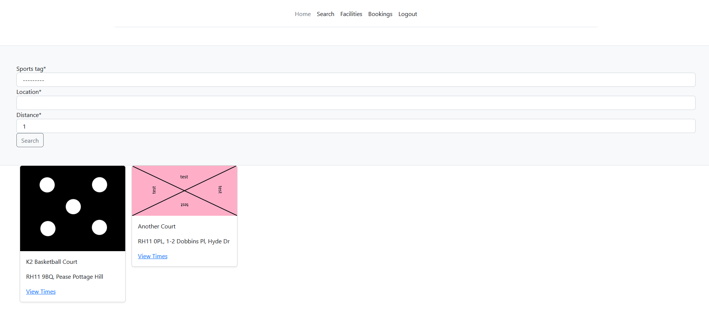

### Admin Features
- See all the facilities you are in charge of
    - Or if site Admin see all facilities
    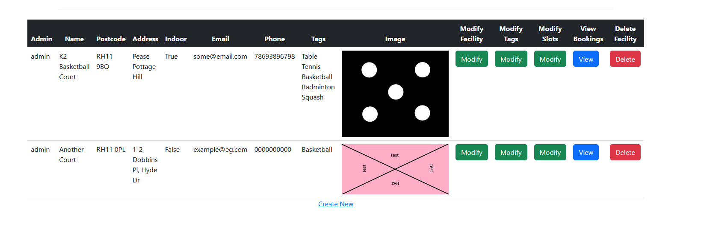

- Edit the tags of a facility
    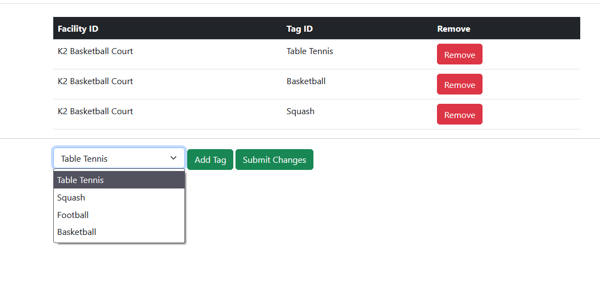

- Edit, Add, Remove sports to tag facilities with (Site admins only)
    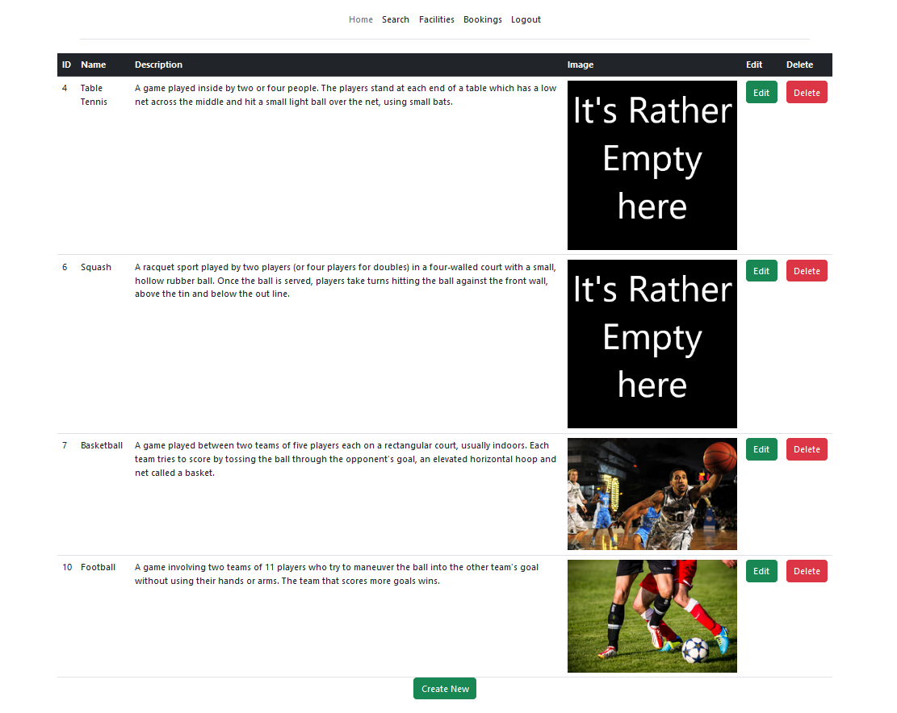

- Edit, Add and Remove timeslots from facilities
    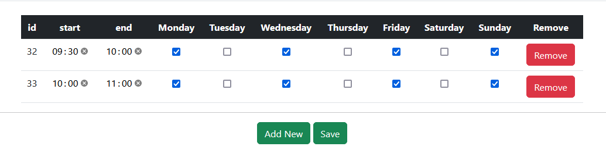

### Other
- When a facility is made, using geopy the location is geocoded using given address and the longitude latitude is stored, and using the [Haversine formula](https://en.wikipedia.org/wiki/Haversine_formula) and javascript code I turned to python from [here](https://stackoverflow.com/questions/27928/calculate-distance-between-two-latitude-longitude-points-haversine-formula/27943#27943) whenever someone makes a search for facilities all results will be within the radius set. 

## CRUD
### Create
- Creating a new Facility
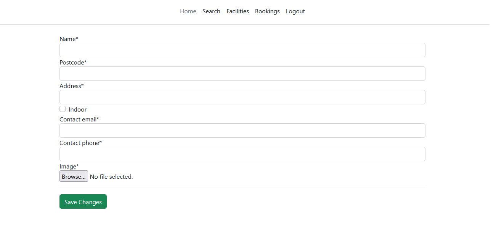 
### Read
- Viewing Facilities
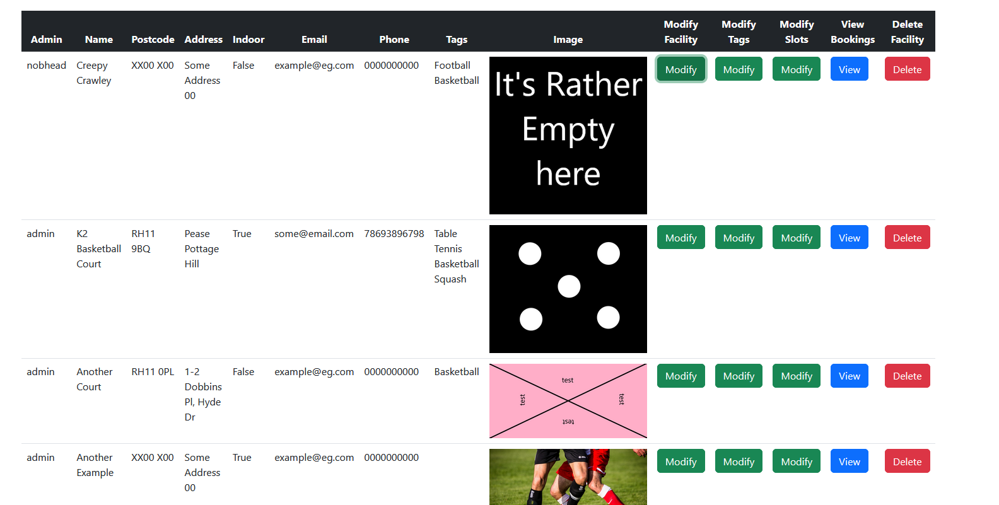
### Update
- Updating a Facility
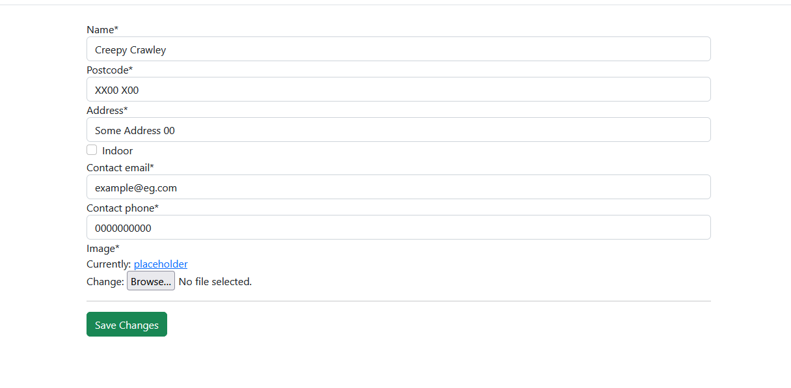
### Delete
- Deleteing a Facility
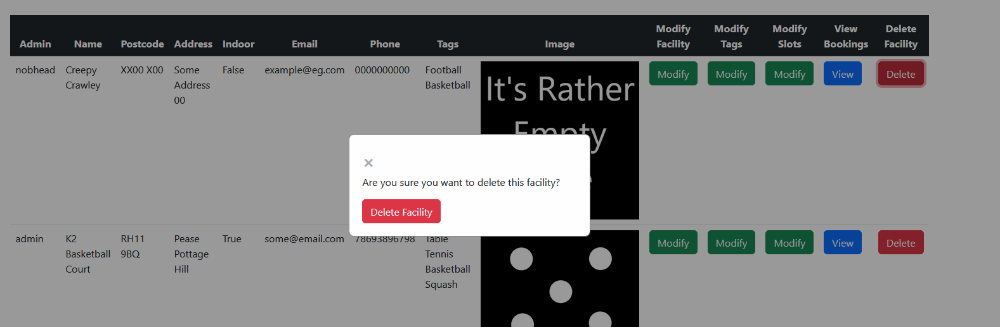
### Multiple in one
- Updating a facilities tags, this involves `Create`, `Read`, `Delete`
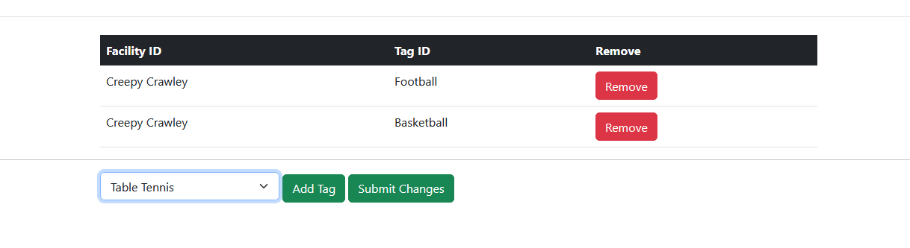
- Updating a timeslots involves entire of CRUD
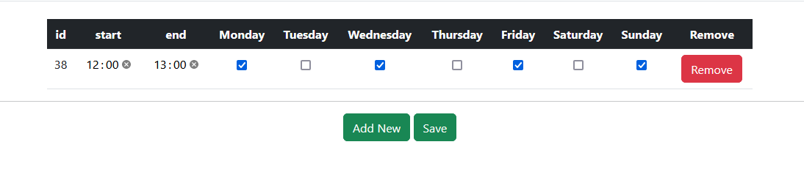
## Features left to implent
- As currently the geocoder I am using does not know the location of some places and is a bit off for others, it will default to a placeholder location to get around this I'd like to do one of the two, or both:
    - Use googles geocode api as its more precise (currently it is paid for)
    - Have a clickable map for facility owners to select where there facility it

- Email updates to users when booked or cancelled
- Show available days on results screen

# Testing
See [TESTING.md](TESTING.md)

# Deployment
The app was deployed using heroku, to do so, the steps are as follows:
1. You will need a [Cloudinary](https://cloudinary.com) account to be able to store images and static files
    1. Go to [Cloudinary](https://cloudinary.com)
    2. Create an account
    3. Go to your [console](https://cloudinary.com/console/)
    4. A square should be present with the header "Api Environment variable", copy this value for later
2. Create an account on heroku and login
3. In Heroku, select new and "Create new app"
4. Select a unique name and select a region for hosting, and create the app
1. Next we need to add the "Heroku Postgres" add-on and get the database "URI"
    1. Navigate to the Resources tab 
    2. A search bar saying "Quickly add add-ons from Elements" should be present, in it search for "Heroku Postgres"
    3. Add the add-on, and in the popup which asks for a "Plan name" select "Hobby Dev - Free"
    1. On the "Resources tab" select the add-on we have added, and select the "Settings" tab
    1. A section titled "Database Credentials" will have a button saying "View Credentials..." select it and copy the the string given under "URI" and keep it somewhere safe for a later step
5. Navigate to settings for your new app, scroll down and click the button "Reveal Config Vars"
6. Add a new variable called "CLOUDINARY_URL" and paste in the value from step 1, make sure you remove the "CLOUDINARY_URL=" at the start of the key
7. Add another variable called "DATABASE_URL" and add the URI gotten from step 5
8. Create another variable called "SECRET_KEY" and name it anything you want
9. Now create the final variable "DEBUG" and set it to FALSE
1. As of writing this, you will need to deploy the site using the heroku CLI
    1. Go to [this](https://devcenter.heroku.com/articles/heroku-cli) link and find your prefered way to install the heroku CLI
    2. Once installed login to your heroku account using ```heroku login``` 
        - if you are following this from gitpod or a inbrowser IDE instead use ```heroku login -i``` to login from the browser 
    3. Now clone the respostory using ```git clone https://github.com/edenobrega/sports-hall-booking-5p```
    4. And now the following commands:
        1. ```git pull origin```
        2. ```git checkout main```
        3. ```heroku git:remote -a app-name``` "app-name" being what you named your heroku app
        4. ```git push heroku main:main```
# Local Deployment
In order to make a local copy of this project, you can clone it. In your IDE Terminal, type the following command to clone my repository:

- `git clone https://github.com/edenobrega/sports-hall-booking-5p.git`

Alternatively, if using Gitpod, you can click below to create your own workspace using this repository.

[](https://gitpod.io/#https://github.com/edenobrega/sports-hall-booking-5p)

1. Create a file in the root called `env.py`, insde of the file copy the following:
    1. `import os`
    2. `os.environ["APP_SECRET_KEY"] = ''`
    3. `os.environ["DATABASE_URL"] = ''`
    4. `os.environ["CLOUDINARY_URL"] = ''`
    5. `os.environ["DEBUG"] = "True"`
The following steps will all be done in your IDE Terminal
1. pip3 install -r requirements.txt
2. Eenter `python3 manage.py makemigrations`
3. And then enter `python3 manage.py migrate`
4. To run the site enter `python3 manage.py runserver`


## Technologies used
- I used [git](https://git-scm.com/) for version control and storage.
- To help with using git, I used [github](https://github.com/).
- I used github projects to keep track of where I was in my project
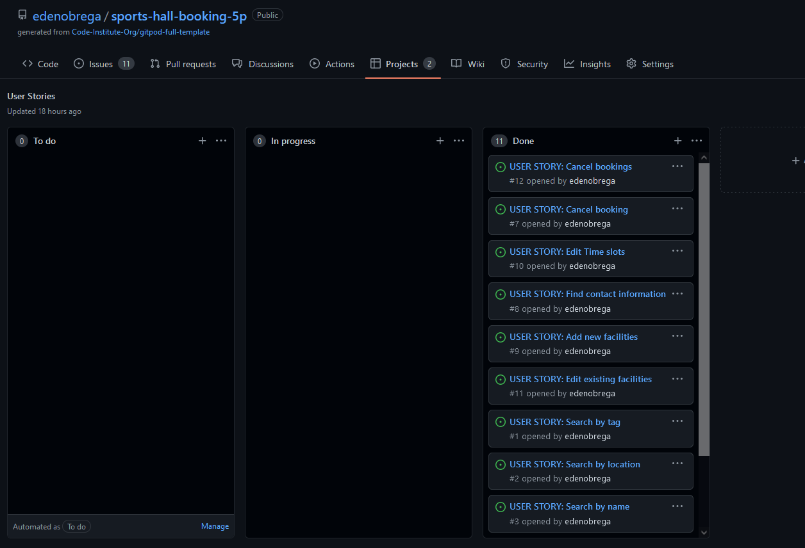
- I used [html](https://en.wikipedia.org/wiki/HTML) to design the site.
- And [CSS](https://en.wikipedia.org/wiki/CSS) to style the site.
- For most of the sites layout ive used [Bootstrap](https://getbootstrap.com/) and its many [examples](https://getbootstrap.com/docs/5.2/examples/) to help with quick development
- Using [Django](https://www.djangoproject.com/) to create the backend to the site
- For some of the forms like "facility/tags/modify/", and the calendar on the booking page I used [Javascript](https://en.wikipedia.org/wiki/JavaScript) and [JQuery](https://jquery.com/) to create the functionality
- To help with styling I used a css debugger to help me with things like positioning and size: [link](https://github.com/benscabbia/x-ray).
- For my IDE I used Gitpod, [link](https://www.gitpod.io/).
- To host static files like images and css i used [Cloudinary](https://cloudinary.com/) and its django library "cloudinary"
- To deploy the website I used [Heroku](https://dashboard.heroku.com/)