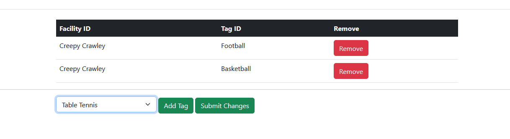
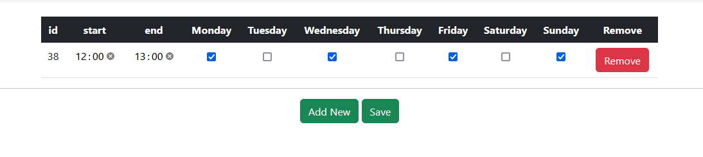

Return to [README](README.md)

# Testing
## User Accounts
- When trying to login to an account that doesnt exist or with incorrect details the error message is shown

- Once logged in the navbar will change

- Must fill all required inputs to create an account

## Search
- Searching for facilities will return the correct amount within the given radius

- Searching an area with no facilities will return none with a message saying so

## Bookings
- Nav link will lead to a page showing you all of your bookings

- Viewing a day with a booked timeslot will be in grey with no booking button

- Selecting a day and clicking book will give a pop up before booking

- Cancelling a booking will delete it and display the relevant message

- As an admin can see all bookings for a facility, and cancel them

## Tags
- Can view all tags

- Can modify tags

- Can delete tags

- Can create tags

## Facilities
- Can View facilities

- Can Create facility

- Can Delete facility

- Can Modify Facility

- Can Modify Facility Tags

- Can Modify Facility Time Slots
 

# Responsiveness
Screenshots taken on mobile for the two pages that a user who is booking would see
- Index

- Search Result

# Code Validation
- PEP8 validation for view.py, giving no errors or warnings
