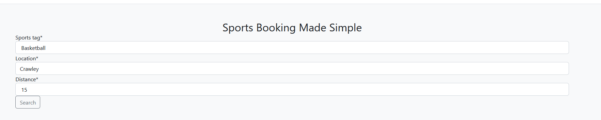
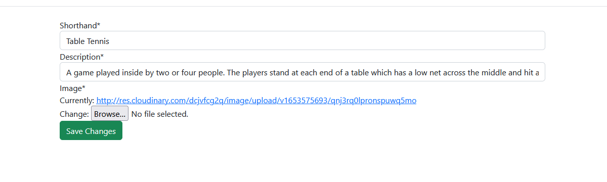
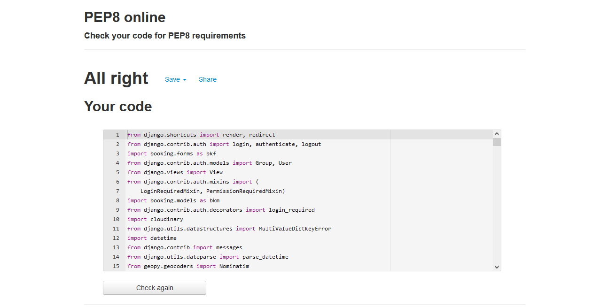
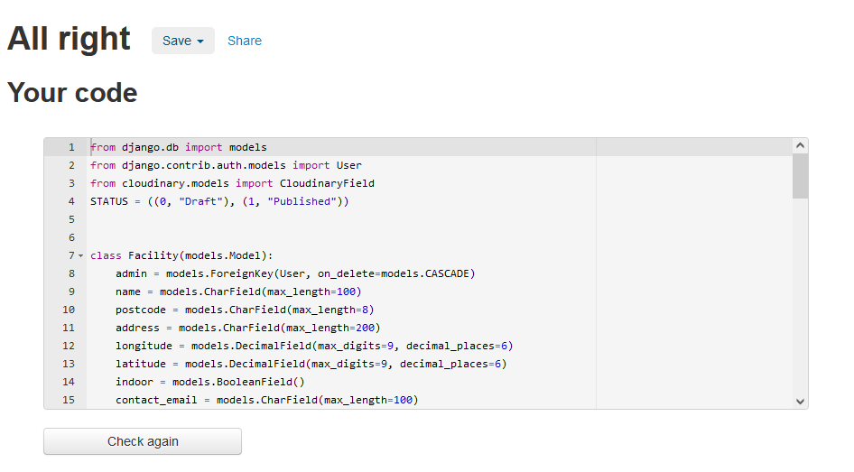

Return to [README](README.md)

# Testing
## User Accounts
- When trying to login to an account that doesnt exist or with incorrect details the error message is shown

- Once logged in the navbar will change

- Must fill all required inputs to create an account

## Search
- Searching for facilities will return the correct amount within the given radius

- Searching an area with no facilities will return none with a message saying so

## Bookings
- Nav link will lead to a page showing you all of your bookings

- Viewing a day with a booked timeslot will be in grey with no booking button

- Selecting a day and clicking book will give a pop up before booking

- Cancelling a booking will delete it and display the relevant message

- As an admin can see all bookings for a facility, and cancel them

## Tags
- Can view all tags

- Can modify tags

- Can delete tags

- Can create tags

## Facilities
- Can View facilities

- Can Create facility

- Can Delete facility

- Can Modify Facility

- Can Modify Facility Tags

- Can Modify Facility Time Slots
 

# Responsiveness
Screenshots taken on mobile for the two pages that a user who is booking would see
- Index

- Search Result

# Code Validation
## Python
- Validation for view.py, giving no errors or warnings

- Validation for forms.py

- Validation for group_check.py

- Validation for month_name.py

- Validation for ordinal_format.png

- Validation for models.py

- Validation for urls.py 

## HTML
Validated using https://validator.w3.org
- [Index](https://validator.w3.org/nu/?doc=https%3A%2F%2Fbookit-5p.herokuapp.com)
- [Login](https://validator.w3.org/nu/?doc=https://bookit-5p.herokuapp.com/login)
- [Register](https://validator.w3.org/nu/?doc=https://bookit-5p.herokuapp.com/register)

- view_times.html

- search_results.html

- view_bookings

- modify_timeslots

- modify_facility_tags

- modify_facility

## CSS
For css I have used https://jigsaw.w3.org/css-validator to validate my stylesheets
- [calender.css](https://jigsaw.w3.org/css-validator/validator?uri=https%3A%2F%2Fres.cloudinary.com%2Fdcjvfcg2q%2Fraw%2Fupload%2Fv1653754742%2Fstatic%2Fcss%2Fcalender.ba4248a0e6d9.css&profile=css3svg&usermedium=all&warning=1&vextwarning=&lang=en)
- [edit_tags.css](https://jigsaw.w3.org/css-validator/validator?uri=https%3A%2F%2Fres.cloudinary.com%2Fdcjvfcg2q%2Fraw%2Fupload%2Fv1651229170%2Fstatic%2Fcss%2Fedit_tags.ca532f4f9149.css&profile=css3svg&usermedium=all&warning=1&vextwarning=&lang=en)
- [index.css](https://jigsaw.w3.org/css-validator/validator?uri=https%3A%2F%2Fres.cloudinary.com%2Fdcjvfcg2q%2Fraw%2Fupload%2Fv1653569905%2Fstatic%2Fcss%2Findex.88d033533e16.css&profile=css3svg&usermedium=all&warning=1&vextwarning=&lang=en)
- [list_facility.css](https://jigsaw.w3.org/css-validator/validator?uri=https%3A%2F%2Fres.cloudinary.com%2Fdcjvfcg2q%2Fraw%2Fupload%2Fv1653868144%2Fstatic%2Fcss%2Flist_facility.1d04c4500c10.css&profile=css3svg&usermedium=all&warning=1&vextwarning=&lang=en)
- [list_tags.css](https://jigsaw.w3.org/css-validator/validator?uri=https%3A%2F%2Fres.cloudinary.com%2Fdcjvfcg2q%2Fraw%2Fupload%2Fv1653868144%2Fstatic%2Fcss%2Flist_tags.8994ac72288d.css&profile=css3svg&usermedium=all&warning=1&vextwarning=&lang=en)
- [login.css](https://jigsaw.w3.org/css-validator/validator?uri=https%3A%2F%2Fres.cloudinary.com%2Fdcjvfcg2q%2Fraw%2Fupload%2Fv1653564284%2Fstatic%2Fcss%2Flogin.b0671f9ed80e.css&profile=css3svg&usermedium=all&warning=1&vextwarning=&lang=en)
- [modal.css](https://jigsaw.w3.org/css-validator/validator?uri=https%3A%2F%2Fres.cloudinary.com%2Fdcjvfcg2q%2Fraw%2Fupload%2Fv1653569904%2Fstatic%2Fcss%2Fmodal.ad6eb2a34f31.css&profile=css3svg&usermedium=all&warning=1&vextwarning=&lang=en)
- [modify_facility_tags.css](https://jigsaw.w3.org/css-validator/validator?uri=https%3A%2F%2Fres.cloudinary.com%2Fdcjvfcg2q%2Fraw%2Fupload%2Fv1653564284%2Fstatic%2Fcss%2Fmodify_facility_tags.243e84a9bbb7.css&profile=css3svg&usermedium=all&warning=1&vextwarning=&lang=en)
- [modify_timeslots.css](https://jigsaw.w3.org/css-validator/validator?uri=https%3A%2F%2Fres.cloudinary.com%2Fdcjvfcg2q%2Fraw%2Fupload%2Fv1653564283%2Fstatic%2Fcss%2Fmodify_timeslots.ea40933244ba.css&profile=css3svg&usermedium=all&warning=1&vextwarning=&lang=en)
- [Search_results.css](https://jigsaw.w3.org/css-validator/validator?uri=https%3A%2F%2Fres.cloudinary.com%2Fdcjvfcg2q%2Fraw%2Fupload%2Fv1653868144%2Fstatic%2Fcss%2Fsearch_results.73235d1e58a0.css&profile=css3svg&usermedium=all&warning=1&vextwarning=&lang=en)
- [style.css](https://jigsaw.w3.org/css-validator/validator?uri=https%3A%2F%2Fres.cloudinary.com%2Fdcjvfcg2q%2Fraw%2Fupload%2Fv1653564282%2Fstatic%2Fcss%2Fstyle.c73d8f77d3d4.css&profile=css3svg&usermedium=all&warning=1&vextwarning=&lang=en)
